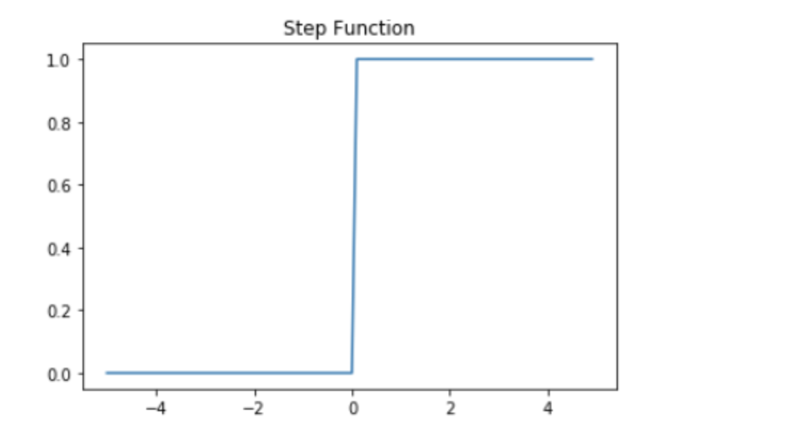
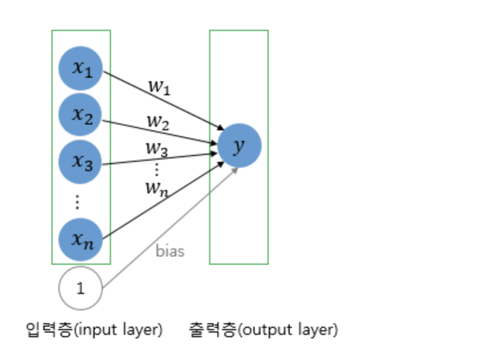
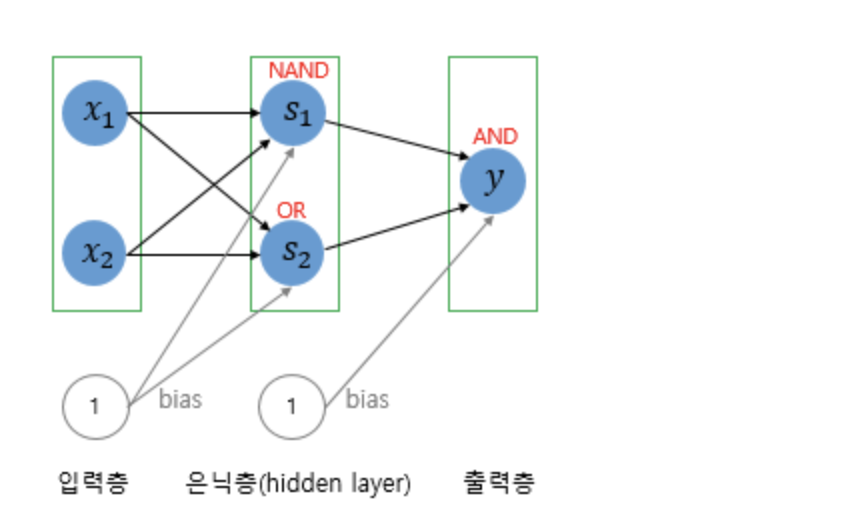

# 3주차 학습

> 학습기간: 3.19-3.20

딥러닝 : 머신러닝의 특정 한 분야, 인공 신경망(Artificial Neural Network)의 층을 연속적으로 깊게 쌓아올려 데이터를 학습하는 방식

초기 인공 신경망: 퍼셉트론

다수의 입력을 받아 하나의 출력
x는 입력값을 의미하며, w는 가중치(Weight), y는 출력값입니다.

각각의 입력값에는 각각의 가중치가 존재하는데, 이때 가중치의 값이 크면 클수록 해당 입력 값이 중요하다는 것을 의미합니다.

각 입력값이 가중치와 곱해져서 인공 뉴런에 보내지고, 각 입력값과 그에 해당되는 가중치의 곱의 전체 합이 임계치(threshold)를 넘으면 종착지에 있는 인공 뉴런은 출력 신호로서 1을 출력하고, 그렇지 않을 경우에는 0을 출력합니다. 이러한 함수를 계단 함수(Step function)라고 하며, 아래는 그래프는 계단 함수의 하나의 예를 보여줍니다.

여기서 출력값을 변경하는 함수는 계단함수 이지만 다른 함수를 사용해도 됩니다. => 활성화 함수

퍼셉트론은 2가지로 나눠진다.

- 단층
- 다층: 은닉층 추가
  - 단층 -> 다층으로 넘어간 이유?
    

## 다층



은닉층이 2개 이상 일 경우 -> 심층 신경망 (Deep Neural Network, DNN)

xor 게이트 단층으로 구현 X

퍼셉트론에서 가중치를 스스로 자동화 -> learning 단계 필요

## 인공신경망

- FFNN
  - 다층 퍼셉트론 유사
- RNN
  - 은닉층 출력값이 은닉값 입력 사용

## 필수 개념

- 손실 함수는 실제값과 예측값의 차이를 수치화해주는 함수입니다.
  - 텐서플로우 문서에서 확인
- 배치는 가중치 등의 매개 변수의 값을 조정하기 위해 사용하는 데이터의 양을 말합니다.
  - 왜 필요? -> 손실 함수 최소화...(옵티마이저 과정 = 역전파 과정)
- 에포크: 훈련 횟수
- 배치 크기: 배치 크기는 몇 개의 데이터 단위로 매개변수를 업데이트 하는지를 말합니다. 현실에 비유하면 문제지에서 몇 개씩 문제를 풀고나서 정답지를 확인하느냐의 문제 마치 기계 입장에서 학습하는 시점

코드로 통한 학습 방법: 케라스나 텐서플로우 공식 문서( https://keras.io/ or https://www.tensorflow.org/guide/keras?hl=ko )를 참고하자.
